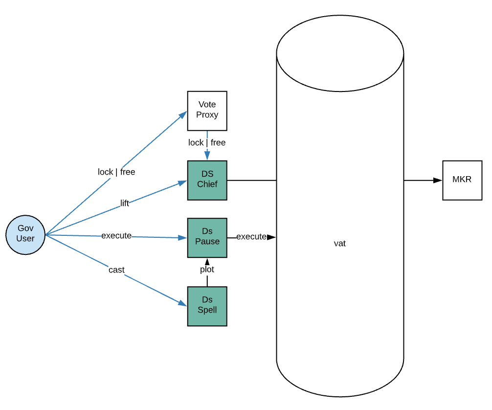

# Spell - Detailed Documentation

* **Contract Name:** spell.sol
* **Type/Category:** Governance Module
* [**Associated MCD System Diagram**](https://github.com/makerdao/dss/wiki#system-architecture)
* [**Contract Source**](https://github.com/dapphub/ds-spell/blob/master/src/spell.sol)

## 1. Introduction \(Summary\)

A `DSSpell` is an un-owned object that performs one action or series of atomic actions \(multiple transactions\) one time only. This can be thought of as a one-off DSProxy with no owner \(no DSAuth mix-in, it is not a DSThing\).

This primitive is useful to express objects that do actions which shouldn't depend on "sender", like an upgrade to a contract system that needs to be given root permission. By convention, it is usually what is used to change SCD or MCD system parameters \(where it is given auth via voting in [ds-chief](https://github.com/dapphub/ds-chief/blob/master/src/chief.sol)\).

## 2. Contract Details

The `spell.sol` contract contains two main contracts: DSSPELL and DSSpellBook. DSSPELL is the core contract that, with call instructions set in the constructor, can actually perform the one-time action. DSSpellBook is a factory contract designed to make the creation of DSSPELLs easier.

### Glossary \(Spell\)

* `whom` - is the address the spell is targeting, usually SAI\_MOM in SCD.
* `mana` - is the amount of ETH you are sending, which in spells it is usually 0.
* `data` - bytes memory calldata.
* `done` - indicates that the spell has been called successfully.

## 3. Key Mechanisms & Concepts

* `hat` - A spell comes into effect as the hat when someone calls the lift function. This is only possible when the spell in question has more MKR voted towards it than the current hat.
* `cast` - Once a spell has become the hat, it can be cast and its new variables will go into effect as part of the live Maker system. It is worth noting that a spell can only be cast once.
* `lift` - The process whereby a new spell replaces the old proposal.

**Note:** the `hat` and `lift` have more to do with `ds-chief` than `ds-spell` but are important to mention here for context.

#### **Immutable Actions**

`whom`, `mana`, and `data` are set in the constructor, so the action a spell is to perform cannot be changed after the contract has been deployed.

## 4. Gotchas \(Potential source of user error\)

Note that the spell is only marked as "done" if the CALL it makes succeeds, meaning it did not end in an exceptional condition and it did not revert. Conversely, contracts that use return values instead of exceptions to signal errors could be successfully called without having the effect you might desire. "Approving" spells to take action on a system after the spell is deployed generally requires the system to use exception-based error handling to avoid griefing.

## 5. Failure Modes \(Bounds on Operating Conditions & External Risk Factors\)

* `spell` - A spell may remain uncast if it did not reach the required amount of MKR in order to pass. If this occurs, the spell may remain available as a later target if enough MKR is voted towards it.
* `lift` - Although spells cannot be cast a second time, they can be lifted to become the hat more than once if enough MKR votes remain on that proposal. The proposals parameters will not go into effect, however any additional spell will need to have more than that amount of MKR voted towards it in order to become the new hat. See [forum post](https://forum.makerdao.com/t/an-explanation-of-continuous-voting-and-the-peculiarities-of-the-7-26-executive-stability-fee-vote/193) for a description of this having once occurred.
* `cast` - If, when `cast` is called, the spell's one-time action fails, `done` does not get flipped and the spell remains castable.

